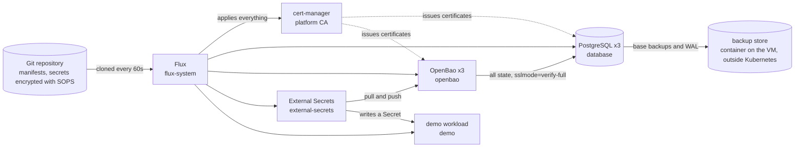
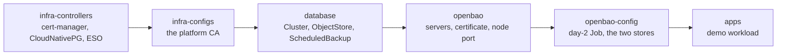
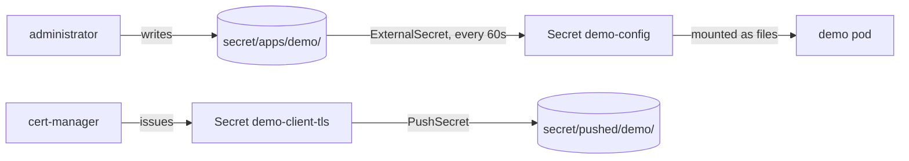

# openbao-gitops-platform

The local cluster runs Flux, cert-manager, CloudNativePG with a three-instance PostgreSQL cluster backed up to the VM's backup store, OpenBao in HA on that database, External Secrets Operator synchronising secrets in both directions, and the OpenBao API exposed over TLS on a host port.

Goal: OpenBao in HA mode with an HA PostgreSQL backend, deployed with Flux, and External Secrets Operator syncing secrets between OpenBao and Kubernetes in both directions.

It runs on a local kind cluster with one control-plane node and three workers.

Saved command output backing the claims below is in [Evidence](docs/evidence/). Which parts are production-ready and which are simplified for this demo is in [Production readiness](docs/production-readiness.md).

## Architecture

Everything except the backup store lives inside the kind cluster. That separation is what lets the
cluster be deleted and rebuilt from Git and the backups, which is the rehearsal in
[Disaster recovery](docs/disaster-recovery.md).

## Versions

| Tool | Version |
|---|---|
| kind | v0.33.0 |
| Kubernetes | v1.36.4 |
| kubectl | v1.36.4 |
| Flux CLI | v2.9.5 |
| sops | v3.13.3 |
| age | v1.3.2 |
| Versity S3 Gateway | v1.8.0 |
| cert-manager | v1.21.2 |
| CloudNativePG | v1.30.0 |
| Barman Cloud Plugin | v0.15.0 |
| PostgreSQL | 18.6 |
| OpenBao | 2.6.3 |
| External Secrets Operator | 2.11.0 |

## Local tools

    scripts/install-tools.sh
    source scripts/env.sh

`install-tools.sh` downloads the pinned CLIs into `.bin/` and checks their SHA-256 checksums. `env.sh` puts `.bin/` first on `PATH` and sets `KUBECONFIG` to `~/.kube/openbao-local`.

## Local cluster

    kind create cluster --config bootstrap/kind-cluster.yaml --kubeconfig ~/.kube/openbao-local

One control-plane node and three workers, Kubernetes v1.36.4. Only the control-plane node has the `node-role.kubernetes.io/control-plane:NoSchedule` taint, so workloads run on the workers. CoreDNS and the local-path provisioner tolerate the taint and run on the control-plane node. Pod network 10.200.0.0/16, service network 10.210.0.0/16, kind Docker network 172.18.0.0/16.

To remove the cluster:

    kind delete cluster --name openbao-local --kubeconfig ~/.kube/openbao-local

## GitOps

Flux v2.9.5 is bootstrapped with `flux bootstrap git` over SSH (see ADR-003). The CLI pushes through an SSH agent holding a key that can push to this repository:

    eval "$(ssh-agent -s)"
    ssh-add ~/.ssh/id_ed25519
    flux bootstrap git \
      --context=kind-openbao-local \
      --url=ssh://git@github.com/Hamidhrf/openbao-gitops-platform \
      --branch=main \
      --path=clusters/local
    eval "$(ssh-agent -k)"

Bootstrap generates a key for the cluster and prints its public key. That key is added to the repository as a read-only deploy key before confirming the prompt. If bootstrap times out waiting for the first clone, source-controller keeps retrying every minute; `flux get sources git -A` shows when it succeeds.

The source, kustomize, helm and notification controllers run in `flux-system` and sync `clusters/local/` from `main`. The files in `clusters/local/flux-system/` are generated by bootstrap and are not edited by hand.

After bootstrap, the age key for SOPS is installed once (see ADR-002):

    kubectl --context kind-openbao-local create secret generic sops-age \
      --namespace flux-system \
      --from-file=age.agekey="$HOME/.config/sops/age/keys.txt" \
      --dry-run=client -o yaml \
      | kubectl --context kind-openbao-local apply -f -

Check:

    flux check --context kind-openbao-local
    flux get all -A --context kind-openbao-local

## Repository layout

`clusters/local/` holds one Flux Kustomization per file, next to the generated `flux-system` directory. `infrastructure/controllers/` holds the operators, `infrastructure/configs/` the cluster-wide configuration they consume, `platform/` the services this repository delivers, and `apps/` the workloads that consume them. Each Kustomization depends on the previous one and waits for it, which is what registers CRDs before the resources that use them (see ADR-006):

    infra-controllers -> infra-configs -> database -> openbao -> openbao-config -> apps

Namespaces, chart sources and HelmReleases for a component live together in that component's namespace.

    flux get kustomizations --context kind-openbao-local

## Backup store

PostgreSQL backups go to a Versity S3 Gateway container on the VM, outside kind (see ADR-005). Flux does not manage it. `scripts/backup-store.sh` starts it and can be run again.

The store credential is created once and committed encrypted with SOPS. The random values go straight into `sops`, so no plaintext file is written:

    test ! -e scripts/backup-store.sops.env && (
      umask 077
      printf 'ROOT_ACCESS_KEY_ID=%s\nROOT_SECRET_ACCESS_KEY=%s\n' \
        "$(/usr/bin/openssl rand -hex 10)" "$(/usr/bin/openssl rand -hex 20)" \
      | .bin/sops encrypt --filename-override scripts/backup-store.sops.env \
          --output scripts/backup-store.sops.env
    )

Start:

    scripts/backup-store.sh

The script stops if the kind network gateway is not `172.18.0.1`, if less than 40 GB is free, or if port 9000 is taken before the first start. On the first run it creates `~/backup-store/` (mode 700) with `objects/` for the backups and `tls/` for a self-signed certificate (IP SAN `172.18.0.1`, valid for 365 days). The container runs as the calling user with all capabilities dropped, a read-only root filesystem, `no-new-privileges` and restart policy `unless-stopped`. Port 9000 is published only on the kind gateway. `sops exec-env` decrypts the credential only for the step that starts the container and creates the bucket `pg-backups`.

Check:

    curl -s -o /dev/null -w '%{http_code}\n' \
      --cacert ~/backup-store/tls/server.crt https://172.18.0.1:9000/health

This returns 200. Without `--cacert`, curl rejects the self-signed certificate, and the VM's LAN address does not answer on port 9000.

## Database

PostgreSQL runs as the CloudNativePG cluster `openbao-db` in the `database` namespace (see ADR-004). cert-manager, the CloudNativePG operator and the Barman Cloud Plugin come from the `infra-controllers` Kustomization. The cluster, its `ObjectStore` and the daily `ScheduledBackup` come from `database`, which depends on it.

Three instances run one per worker, enforced with required pod anti-affinity on `kubernetes.io/hostname`. Synchronous replication uses `method: any` with one required acknowledgement and `dataDurability: required`, and `failoverQuorum` adds a quorum check before any promotion. The operand image is pinned by digest. Resource requests equal limits, so the instances get Guaranteed quality of service.

The database credential is a SOPS-encrypted Secret in Git, used by the operator when the cluster is created. Backup store credentials and the store's CA certificate live in the same namespace, because the `ObjectStore` is resolved there.

Check:

    kubectl --context kind-openbao-local get cluster -n database
    kubectl --context kind-openbao-local get pods -n database -o wide
    kubectl --context kind-openbao-local get cluster openbao-db -n database -o jsonpath='{range .status.conditions[*]}{.type}={.status} {end}{"\n"}'

Backup and restore procedures are in [Backup and restore](docs/backup-restore.md). Rebuilding the platform after the Kubernetes cluster is lost is in [Disaster recovery](docs/disaster-recovery.md).

### Failover

Observed on 23 September 2026 on this cluster.

Deleting the primary pod promoted a standby about one second later, and the deleted instance rejoined as a standby.

Stopping the worker that ran the primary took longer. The node was marked NotReady after 46 seconds, the pod was marked for deletion five minutes after that by the default toleration for `node.kubernetes.io/unreachable`, and promotion followed within a second. On a node failure the recovery time is dominated by that Kubernetes default rather than by the operator, and it can be shortened with a shorter toleration on the instance pods.

Stopping two of three workers left one reachable instance out of two candidate standbys. The operator refused to promote it and logged a failed strong consistency check, because it cannot establish that the survivor holds every acknowledged commit. Writes stopped rather than risking their loss. The cluster returned to three healthy instances on its own once the workers came back, with no manual promotion. `kubectl cnpg promote` exists for the case where availability matters more than possible data loss, and it stays a deliberate human decision.

All nodes are containers on one VM, so a node failure here is a container failure rather than a host or zone failure. Instance volumes are node-local, so an instance on a stopped node cannot be rescheduled elsewhere and returns only when that node does.

## TLS and the certificate authority

The PostgreSQL server certificate is issued by cert-manager from the platform CA (see ADR-007). A self-signed `ClusterIssuer` creates the root certificate `platform-ca` in the `cert-manager` namespace, and a CA `ClusterIssuer` signs with it. The `database` namespace holds a `Certificate` whose Secret the cluster references as both `serverTLSSecret` and `serverCASecret`, labelled `cnpg.io/reload` so the instances pick up a renewed certificate without a restart. CloudNativePG keeps its own CA for the client and replication certificates, so the database has two trust domains. The same platform CA issues OpenBao's listener certificate, which is how OpenBao obtains the CA it needs to verify PostgreSQL with `sslmode=verify-full`.

Switching the running cluster from the operator's certificates to these was a reload: the instance pods kept their UIDs and restart counts and the cluster never left the Ready condition.

Check:

    kubectl --context kind-openbao-local get certificate -A
    kubectl --context kind-openbao-local get cluster openbao-db -n database -o jsonpath='{.status.certificates}{"\n"}'

A client inside the cluster connecting to `openbao-db-rw.database.svc` with `sslmode=verify-full` and this CA completes the handshake and is refused only at authentication. Connecting to the same server by IP address is refused, because the certificate carries no IP address.

## OpenBao

OpenBao runs in the `openbao` namespace with three replicas, one per worker, using the PostgreSQL cluster in the `database` namespace as its storage backend. It is deployed by a Flux `HelmRelease` for chart `openbao` 0.29.6, with the server image pinned by digest.

The pods hold no persistent state. All data lives in PostgreSQL, so no volumes are requested and a pod can be deleted and recreated without data loss.

### Storage backend

The connection uses the standard PostgreSQL environment variables instead of a connection URL, so the password never appears inside a connection string. `PGSSLMODE` is `verify-full` and `PGSSLROOTCERT` points at the `ca.crt` that cert-manager writes into OpenBao's own listener secret, which is the same platform CA that signed the database server certificate.

| Parameter | Value | Reason |
|---|---|---|
| `max_parallel` | 16 | The default of 128 would allow up to 384 connections from three replicas against a primary whose `max_connections` is 100. |
| `transaction_max_parallel` | 15 | Keeps one connection available for HA lock renewal. Version 2.7.0 enforces this relationship automatically. |
| `max_connect_retries` | 50 | The retry backoff starts at 15 ms and caps at 5 s, so 50 attempts cover about three minutes. |

### Listener TLS

The listener certificate is issued by the platform CA and covers the `openbao` and `openbao-active` Services in all four name forms plus the wildcard `*.openbao-internal.openbao.svc.cluster.local` used by the per-pod address. Request forwarding on port 8201 uses OpenBao's own internally generated certificate and not this one.

### Seal and initialization

The static seal reads a 32 byte AES-256 key from a file mounted from Secret `openbao-seal`, which is stored SOPS-encrypted in Git. Because unsealing is automatic, the server initializes itself from the `initialize` stanza in its configuration: no root token is returned and no recovery keys are created. The temporary root token is revoked as the last step of initialization.

The stanza enables Kubernetes auth, creates the `admin` policy, binds an `admin` role to the `openbao-admin` ServiceAccount with audience `openbao`, enables `userpass`, and creates a `break-glass` user whose password is read from an environment variable.

Initialization happens once. The three replicas start in order and one acquires the HA initialization lock. A restarted pod unseals from the stored key without re-running the stanza.

The audit device is declared in the server configuration rather than created through the API, because API-driven audit device creation is disabled by default and because a configured device is active before initialization runs, so the initialization requests are themselves audited.

### Administration

Both paths return the `admin` policy together with the built-in `default` policy. Neither uses the `root` policy.

Kubernetes auth:

    TOKEN=$(kubectl --context kind-openbao-local -n openbao create token openbao-admin --audience openbao)
    printf '%s' "$TOKEN" | kubectl --context kind-openbao-local -n openbao exec -i openbao-0 -- sh -c 'read J; BAO_ADDR=https://$HOSTNAME.openbao-internal.openbao.svc.cluster.local:8200 BAO_CACERT=/openbao/userconfig/openbao-tls/ca.crt bao write auth/kubernetes/login role=admin jwt="$J"'

Break-glass, for use when the Kubernetes auth path is unavailable:

    PW=$(sops decrypt platform/openbao/break-glass-password.sops.yaml | awk '/password:/ {print $2}')
    printf '%s' "$PW" | kubectl --context kind-openbao-local -n openbao exec -i openbao-0 -- sh -c 'read P; BAO_ADDR=https://$HOSTNAME.openbao-internal.openbao.svc.cluster.local:8200 BAO_CACERT=/openbao/userconfig/openbao-tls/ca.crt bao write auth/userpass/login/break-glass password="$P"'

A service account token requested without `--audience openbao` is rejected with an invalid audience error.

### External access

The API is reachable from the VM at `https://openbao.local.test:8200` (see ADR-011). A NodePort Service named `openbao-external` selects the active server only, and kind maps host `127.0.0.1:8200` to node port 30820 on the control-plane node. The chart's own Services stay ClusterIP. The name resolves through `/etc/hosts` on the VM and is one of the names on the listener certificate.

The mapping is on the control-plane node so that stopping a worker during a failure test does not take the external endpoint with it. The host port is bound to 127.0.0.1, so reaching it from elsewhere means an SSH forward.

Check, using the platform CA from OpenBao's own listener secret:

    kubectl --context kind-openbao-local -n openbao get secret openbao-tls \
      -o jsonpath='{.data.ca\.crt}' | base64 -d > /tmp/platform-ca.crt
    curl -s -o /dev/null -w '%{http_code}\n' \
      --cacert /tmp/platform-ca.crt https://openbao.local.test:8200/v1/sys/health

This returns 200. Without the CA, curl rejects the certificate. By IP address it is refused for a hostname mismatch, because the certificate carries no IP address.

External access is for a person: an administrator running `bao` from the VM. Workloads reach OpenBao inside the cluster through External Secrets.

### Failover through the external endpoint

Measured on 25 September 2026 with one request per second through the host port.

Stopping the node gracefully cost one failed request. Kubelet shut the pod down, OpenBao released the HA lock on the way out, a standby took it, and the EndpointSlice followed the label, all before the node condition changed.

Killing the node cost about 52 seconds and twelve failed requests: roughly 15 seconds with no leader at all while the HA lock expired, then about 35 seconds during which half the requests reached a pod that no longer existed. The label that marks the active server is set by the pod on itself, so a killed pod cannot clear it, and the Service keeps selecting it until the node condition changes about 50 seconds after the kill.

That is a different clock from the five minute unreachable toleration in the database Failover section above, which governs pod eviction rather than endpoint readiness. A client that retries sees far less than one that does not, and the `bao` CLI does not retry by default.

### Secrets in the `openbao` namespace

| Secret | Contents | Source |
|---|---|---|
| `openbao-seal` | 32 byte seal key | SOPS |
| `openbao-db-credential` | database username and password | SOPS, the same value as the copy in `database` |
| `openbao-break-glass` | break-glass password | SOPS |
| `openbao-tls` | listener certificate, key and CA | cert-manager |

### Operational notes

The StatefulSet uses the `OnDelete` update strategy, so a configuration change does not restart pods by itself. Delete the standbys first and the active pod last, which upgrades leadership last rather than failing over to an older version.

The container's default `BAO_ADDR` is `https://127.0.0.1:8200`, which is not a name on the listener certificate. Commands run inside a pod must pass the pod's own address and `BAO_CACERT`, as the examples above do.

The listener certificate is valid for 90 days and renews at about day 60. Version 2.6.3 has no automatic certificate reload; `tls_auto_reload` arrives in 2.7.0.

## External Secrets

External Secrets Operator runs in the `external-secrets` namespace, installed by a Flux `HelmRelease` in the controllers layer. It moves secrets in both directions: OpenBao to Kubernetes with an `ExternalSecret`, and Kubernetes to OpenBao with a `PushSecret` (see ADR-010). Push is available only through the HashiCorp Vault provider; the dedicated OpenBao provider is read-only.

No path is both the source of a pull and the destination of a push, so a synchronisation loop
cannot form. The two prefixes also record who owns each value: OpenBao owns what is under `apps/`,
and the namespace owns what it sends to `pushed/`.

Two chart defaults are changed. `rbac.serviceAccountTokenCreate` is false, so the controller holds no cluster-wide permission to create tokens for arbitrary ServiceAccounts, and each consuming namespace grants that for named ServiceAccounts instead. The cluster-scoped kinds this platform does not use are not installed and their reconcilers are off, which also removes the controller's `update` and `patch` permission on namespaces.

Check:

    kubectl --context kind-openbao-local -n external-secrets get helmrelease,deploy
    kubectl --context kind-openbao-local get clusterrole external-secrets-controller \
      -o jsonpath='{range .rules[*]}{.apiGroups}{" "}{.resources}{" "}{.verbs}{"\n"}{end}' | grep -E 'serviceaccounts|namespaces'

### Day-2 configuration

The `initialize` stanza runs once, at first initialization, and cannot carry later changes. Everything after it comes from a `Job` in the `openbao` namespace, applied by Flux from `platform/openbao-config/`. The Job runs the same OpenBao image as the servers, logs in through Kubernetes auth as `openbao-admin` with a projected token at audience `openbao`, talks to the `openbao-active` Service so writes reach the active node, and applies the desired state with commands that are safe to repeat.

It owns the KV mount and its version limit, the `eso-pull` and `eso-push` policies, and the two Kubernetes auth roles. It does not touch the seal, the `admin` policy or the `admin` role, which belong to first initialization. It reads the Kubernetes auth mount accessor from the running server before rendering the templated policies, so nothing in Git depends on an identifier that changes when the auth backend is recreated.

The script lives in a ConfigMap generated with a content hash, so changing the script changes the ConfigMap name and therefore the Job's pod template. A Job's spec is immutable, so the Job carries `kustomize.toolkit.fluxcd.io/force: enabled` and Flux replaces it rather than failing to patch it. The Flux Kustomization does not force, because the same directory holds objects that should not be replaced that way.

To apply a configuration change, edit `platform/openbao-config/configure.sh` and push. A Job that has exhausted its attempts has an unchanged spec, so it is re-run either by a change to the script or by deleting the Job, after which Flux applies it again on its next reconcile.

    kubectl --context kind-openbao-local -n openbao get job openbao-configure
    kubectl --context kind-openbao-local -n openbao logs job/openbao-configure

### Secret layout

One KV version 2 engine is mounted at `secret`, with one prefix per direction:

| Path | Direction | Written by |
|---|---|---|
| `secret/apps/<namespace>/...` | OpenBao to Kubernetes | an operator or another system |
| `secret/pushed/<namespace>/...` | Kubernetes to OpenBao | External Secrets, through a `PushSecret` |

No path is both the source of a pull and the destination of a push, so a synchronisation loop cannot form. The mount keeps ten versions of each secret: without a limit KV v2 keeps every version forever, and here every version is a row in PostgreSQL.

The mount is named `secret` because the `admin` policy written once by the `initialize` stanza grants `secret/*`, and that stanza cannot be re-run to widen it.

### Stores and identities

Two `ClusterSecretStore` objects, `openbao-pull` and `openbao-push`. Both address the `openbao-active` Service and both read the CA from the `ca.crt` key of the `openbao-tls` Secret in the `openbao` namespace, which is possible only for a cluster-scoped store and means no namespace has a copy of the CA.

Neither store names a namespace for its ServiceAccount, so each authenticates with a ServiceAccount of that name in the namespace of the resource using it. A consuming namespace therefore provides two ServiceAccounts, `eso-pull` and `eso-push`, neither mounted into any pod, and a `Role` that lets the External Secrets controller create tokens for exactly those two names.

The OpenBao roles bind the ServiceAccount name, an explicit namespace list and the audience `openbao`, and issue tokens that last 20 minutes and carry no default policy. The two policies are templated on the calling namespace, so a namespace reaches only its own prefix even if a role were bound more widely than intended. Both stores also restrict which namespaces may reference them.

A store reporting Ready means its own validation passed, not that any namespace can authenticate through it. Only a working `ExternalSecret` or `PushSecret` shows that.

Check:

    kubectl --context kind-openbao-local get clustersecretstore

### Using it

Write a secret as an administrator. The platform owns the mount, the policies and the roles; the values come from an operator or another system:

    TOKEN=$(kubectl --context kind-openbao-local -n openbao create token openbao-admin --audience openbao)
    printf '%s' "$TOKEN" | kubectl --context kind-openbao-local -n openbao exec -i openbao-0 -- sh -c 'read J; export BAO_ADDR=https://openbao-active.openbao.svc:8200 BAO_CACERT=/openbao/userconfig/openbao-tls/ca.crt; export BAO_TOKEN=$(bao write -field=token auth/kubernetes/login role=admin jwt="$J"); bao kv put secret/apps/demo/config message=hello-from-openbao greeting=guten-tag'

The `demo` namespace in `apps/demo/` consumes it. `pull.yaml` holds an `ExternalSecret` that extracts every key of `apps/demo/config` into a Secret, and a Deployment that mounts that Secret as a directory and prints the files. `push.yaml` holds a cert-manager `Certificate` whose Secret is the source of a `PushSecret` writing the certificate and its key to `secret/pushed/demo/client` as two properties.

    kubectl --context kind-openbao-local -n demo get externalsecret,pushsecret,secret
    kubectl --context kind-openbao-local -n demo logs deploy/demo --tail=3

### Operational notes

Observed on 25 September 2026 on this cluster.

A new value written to OpenBao reached the workload's mounted file about 40 seconds later, with a one minute refresh interval on the `ExternalSecret`, and the pod kept its start time and zero restarts. Two intervals are involved: External Secrets rewrites the Secret on its refresh interval, and the kubelet then updates the mounted files on its own period. A Secret consumed as environment variables would not update at all until the pod restarts, which is why the demo mounts it as a directory.

A `PushSecret` with `deletionPolicy: Delete` holds a finalizer. Deleting the `PushSecret` removes the secret in OpenBao, data and metadata together, before the finalizer clears. The value returns when Flux restores the `PushSecret`, as a new secret starting again at version 1 rather than an older version resurfacing. Deleting it by hand is corrected on the Kustomization's own interval of one hour, not on the one minute interval of the GitRepository, which only governs how quickly new commits are noticed.

Secrets that External Secrets pushed carry the custom metadata `managed-by: external-secrets`. With `updatePolicy: Replace`, a secret without that marker is never overwritten, which is what protects operator-written paths.

The `eso-pull` and `eso-push` tokens have no default policy, so they cannot revoke themselves; they expire instead. That is a deliberate consequence of `token_no_default_policy` and applies to every identity configured that way.

### Limitations

The External Secrets controller holds get, list, watch, create, update, delete and patch on Secrets across the cluster, because that is the job it exists to do. The per-namespace token `Role` narrows which identities it can assume, not what it can read, so reading the CA out of the `openbao-tls` Secret avoids copying rather than establishing a boundary. The boundary that does hold is that the seal key and the certificate authority's private key are in namespaces no store references.

Creating a `PushSecret` is a privileged action: anyone who can create one in an allowed namespace can have the controller read a Secret there and write it into OpenBao. These objects stay in Git, and the permission to create them is not given to application users.

The Job runs when its script changes, not continuously, so configuration changed by hand inside OpenBao stays changed until the next run. A production platform would run the same idempotent reconciliation periodically or use a configuration controller with its own custom resources.

Because the policies are rendered with an accessor discovered at run time, Git holds a template rather than the literal policy, so comparing Git with the live configuration cannot be a text comparison.

A rebuild from Git restores the platform configuration, not the secrets an operator wrote: `secret/apps/demo/config` returns only from a database restore. The pushed certificate is different. At first OpenBao returns the old certificate from the database. cert-manager issues a new one in the new cluster and External Secrets pushes it over the old one, so what stays in OpenBao is a new credential rather than a recovered one. In the rehearsal that took 23 minutes after OpenBao came back.

## Production readiness

The platform runs on one VM, so several production concerns are simplified on purpose. The four that matter most:

All four Kubernetes nodes are containers on one machine, with one control-plane node. A node failure here is a container failure, and losing the VM loses the whole cluster.

The backup store runs on that same machine and disk, with no versioning and no object lock. One disk failure can take the cluster and the only copy of the backups together.

The seal key and the bootstrap credentials are long-lived and kept in Git under SOPS. Someone holding the age identity and a database backup has what is needed to read the data. Production would unseal from a KMS or an HSM instead.

No monitoring stack is deployed. Every component inside the cluster exposes metrics, but nothing collects, stores or alerts on them.

The full list, what production would do instead and what each simplification costs are in [Production readiness](docs/production-readiness.md). What would be monitored, what to alert on and how this platform was troubleshot are in [Observability](docs/observability.md).

## Docs

- [ADR-001: Local runtime environment](docs/adr/001-runtime-environment.md)
- [ADR-002: Bootstrap secrets](docs/adr/002-bootstrap-secrets.md)
- [ADR-003: Flux bootstrap](docs/adr/003-flux-bootstrap.md)
- [ADR-004: PostgreSQL operator](docs/adr/004-postgresql-operator.md)
- [ADR-005: Backup target](docs/adr/005-backup-target.md)
- [ADR-006: Repository layout and namespaces](docs/adr/006-repo-layout-and-namespaces.md)
- [ADR-007: TLS and the certificate authority](docs/adr/007-tls-and-ca.md)
- [ADR-008: OpenBao initialization, unseal and administrative access](docs/adr/008-openbao-init-and-unseal.md)
- [ADR-009: OpenBao version and server configuration](docs/adr/009-openbao-version-and-configuration.md)
- [ADR-010: Day-2 configuration and External Secrets](docs/adr/010-day-2-configuration-and-external-secrets.md)
- [ADR-011: Service exposure](docs/adr/011-service-exposure.md)
- [Backup and restore](docs/backup-restore.md)
- [Disaster recovery](docs/disaster-recovery.md)
- [Observability](docs/observability.md)
- [Production readiness](docs/production-readiness.md)
- [Evidence](docs/evidence/)
- [Time log](TIMELOG.md)
